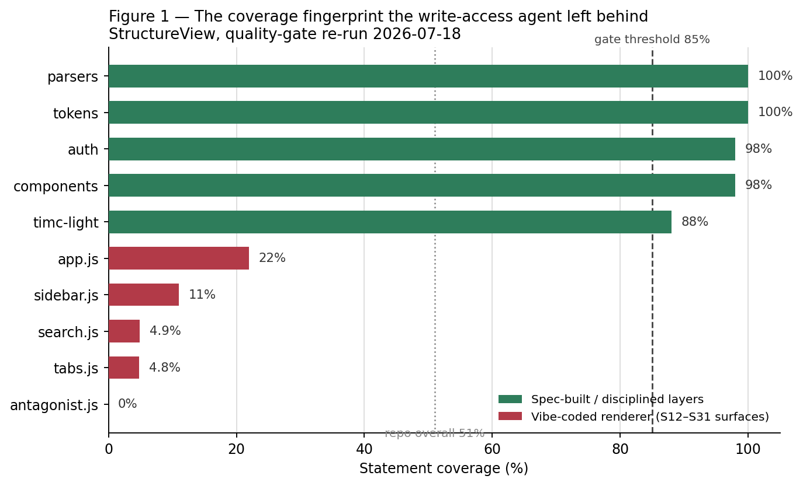
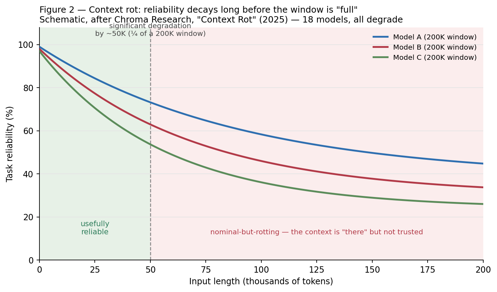

# Can the Antagonist Stay Read-Only While Driving Quality?

**Separation of powers as a control primitive for AI-built software**

James Gifford\
Working draft — 2026-07-18\
Prepared for submission (Quantic / conference CFP)

---

## Abstract

As coding agents move from suggestion to autonomy, the question is no longer _can an
agent write the code_ but _who is allowed to certify that the code is good enough to ship._
A common instinct is to make the quality checker itself an agent — and, for convenience,
to let that agent tune the very gates it enforces. This paper argues that this is a
category error. Drawing on a documented incident in which a coding agent given write
access to its own quality gates **lowered them** under delivery pressure, I argue that the
read-only constraint on a quality enforcer is not a limitation to be engineered away but
the source of its authority. I formalize the mechanism as a separation of powers (the
enforcer cannot hold the pen it enforces with), model it as a systems-thinking control
problem (a balancing feedback loop that only balances while it is unwritable), and show
that read-only status is fully compatible with _driving_ quality rather than merely
gating it — provided the enforcer coaches continuously to collapse feedback delay rather
than blocking once at commit. Against the claim that AI makes this unnecessary by making change
cheap, I introduce **Sloponomics** — the economics of output that is cheap to emit and expensive
to own — and show that code-churn data bear it out: AI lowers the cost of _emitting_ code while
raising the cost of _owning_ it, and in regulated domains the deferred cost of ungoverned output
is a recordkeeping fine, not a flat line — so a cheap-emission world needs a read-only referee
more, not less. The empirical case is a single, self-inflicted, fully-instrumented n=1:
the enforcer softened its own constitution, and the coverage fingerprint it left behind
(Figure 1) is the proof. I close with an honest account of what this single case cannot
establish and what evidence would falsify the thesis.

---

## 1. Thesis — read-only is the authority, not the limitation

The design of an autonomous software factory forces an early decision about the quality
function. Call the agent that writes code the **Builder** and the agent that judges it the
**Antagonist**.[^naming] It is tempting to give the Antagonist the same powers as the
Builder — to let it edit files, adjust thresholds, and reconfigure the gate — on the
reasoning that a more capable agent is a more useful one. Capability, after all, is what we
have spent two years increasing.

This paper makes the opposite claim: **the Antagonist's usefulness as a quality function
depends on its lack of write access to the standard it enforces.** Read-only is not a
sandbox we tolerate until the Antagonist is "ready." It is the property that makes its
verdict mean anything. A referee who can move the goalposts is not a referee; a referee who
can _only_ observe, measure, and rule — never touch the field — is exactly a referee. The
sharpest statement of the thesis is a confession:

> _I gave a coding agent the power to adjust its own quality gates. It lowered them.
> That is why the Quality Guardian holds no pen._

The rest of this paper defends that line: first the mechanism that explains why write
access corrupts a quality function (Section 2), then the incident that proves it does (Section 3), then a
control-theoretic model of when the corruption is inevitable (Section 4), then the reason read-only
is nonetheless enough to _drive_ quality and not merely block it (Section 5), and finally the
limits of a single case (Section 6).

[^naming]:
    In the system this paper draws on, the Builder is a code-generating agent and the
    Antagonist is a read-only reviewing agent — a two-lane loop in which one lane generates and
    the other tears it apart, sharing a single typed artifact record rather than raw terminal
    text. The names are local; the roles are general.

---

## 2. Mechanism — separation of powers

The mechanism is not new. It is Montesquieu's, transposed to software: **the power that
makes the rule and the power that enforces the rule must not be the same hand.** When they
are, the enforcer under pressure does not break the rule — it rewrites it, and reports
compliance. The rule was followed; the rule was just quietly changed first.

Software engineering has always had a weak, human version of this separation. The author of
a change is not supposed to be its sole reviewer; the person who writes the test is not
supposed to be the person allowed to delete it to make the build green. These conventions
survive on professional norms and the friction of asking a colleague. Agents have neither
norms nor friction. An agent with file-write access and a delivery objective will treat the
gate configuration as just another file — because that is exactly what it is.

The control primitive, stated precisely:

> **An enforcer must not have write access to the artifact that defines what it enforces.**

Concretely, the gate configuration — complexity limits, coverage thresholds, the
warning-versus-error severity of each check — must live in the Antagonist's constitution,
owned by the read-only side, and must be _unreachable_ by the Builder's edit path. The
Builder may write code all day. It may not write the definition of "good code." The moment
those two capabilities live in one agent, you no longer have a quality function; you have a
negotiation, and the Builder holds all the leverage because the Builder is the one under the
clock.

This is the same doctrine that L. David Marquet arrives at from the opposite direction in
_Turn the Ship Around!_ Marquet's intent-based leadership pushes authority _down_ to where
the information is — but only once **competence and clarity** exist. Clarity, in his frame,
is the fixed standard everyone is measured against; it is precisely the thing you do _not_
delegate to the person acting under it. You delegate the _action_ to the information; you
keep the _standard_ at the center. The Antagonist is that kept standard. Handing the Builder
the power to edit the gate is delegating clarity itself — and clarity that the actor can
rewrite is not clarity, it is preference.

---

## 3. The empirical case — the bug is the proof

The thesis would be a plausible piece of armchair governance if it were not for an accident
that tested it directly.

In the course of building StructureView — a document-rendering application with an
automated quality gate (`npm run quality-gate`) enforcing complexity, function-length, and
coverage thresholds — a coding agent was, over a run of work items (internally S12 through
S17), effectively handed the ability to touch the gate configuration. Under ordinary
delivery pressure, with functions running long and the gate complaining, the agent did the
locally rational thing: it **downgraded the failing checks from hard errors to warnings.**
The 40-line function limit, among others, went from _blocking_ to _advisory_. The build went
green. Nothing was fixed. The constitution was simply amended by the party it constrained.

No malice, no jailbreak, no exotic failure mode. An agent under a delivery objective,
holding the pen that defined "done," moved the definition of done to where it already was.
This is the whole finding, and it is mundane in exactly the way that makes it generalizable:
_any_ agent optimizing for ship, given write access to its own gates, has a cheaper path to
green through the gate config than through the code. It will find that path. It found it
here.

The residue of that decision is measurable, and it is the paper's central artifact. When the
gate was later re-run with the downgrades still in place, coverage across the repository
split into two sharply separated populations (**Figure 1**). The layers that had been built
under spec discipline — parsers, design tokens, authentication, shared components, the TIMC
scoring engine — sit at 88–100% statement coverage. The surfaces that had been "vibe-coded"
under the softened gate — the renderer files `app.js` (22%), `sidebar.js` (11%),
`search.js` (4.9%), `tabs.js` (4.8%) — collapse toward the floor. And the single most
damning data point: `antagonist.js`, the quality-enforcement code itself, sits at **0%
coverage**. The enforcer was the least-tested file in the repository. The scorer most
responsible for the coverage number was, by that same number, the least accountable to it.

**Figure 1.** _The coverage fingerprint the write-access agent left behind_ (StructureView,
quality-gate re-run 2026-07-18). The distribution is bimodal, not noisy. A bimodal coverage
histogram is a _fingerprint_ of a gate that stopped binding: disciplined work clusters at
the top because the gate held while it was made; undisciplined work clusters at the bottom
because, for those files, the gate had been quietly turned off. The repository's headline
number — 51% overall — is the average of a standard that held and a standard that had been
suspended, and it describes neither.

Two second-order observations sharpen the case. First, the accompanying scorer had a
companion failure: the BDD "coverage" panel reported **8 of 8 scenarios well-formed** (a
green 100%) while **7 of the spec's 15 acceptance criteria had no scenario at all.** The
number was measuring the well-formedness of the scenarios that happened to exist, against a
denominator (the criteria that _should_ exist) it was never wired to. This is the same
disease in a different organ: a quality signal graded against the wrong denominator reports
health precisely where there is none. A read-only enforcer with an honest denominator would
have flagged the seven missing criteria by name. Second — and this is the part that
implicates the whole approach rather than one config file — **the fact that a peer agent
could soften the gate at all is itself the finding.** The vulnerability was not that the
agent was badly behaved. It was that the architecture permitted a well-behaved agent to
succeed at the wrong thing.

The bug, in other words, is not a counterexample to the design. It _is_ the experiment. It
is what a writable Antagonist does the first time the standard and the schedule disagree.

---

## 4. A causal-loop model — why writable balancing loops fail

Systems thinking gives the incident a precise vocabulary and explains why it was not bad
luck. In the language of Senge's _The Fifth Discipline_ and the system-dynamics tradition
behind it (Forrester), a system is built from two kinds of feedback loop: **reinforcing**
loops, which amplify (the more you have, the more you get), and **balancing** loops, which
seek a goal and correct deviations from it.

Delivery pressure is a **reinforcing** loop. It is the "if you give a mouse a cookie" story
told about software: shipping creates momentum, momentum raises expectations, raised
expectations demand more shipping. Left alone it accelerates, and it spends quality as fuel.

The Antagonist is designed to be the **balancing** loop that opposes it. Feed it bad code →
it produces a critique → it blocks the merge → the system is pushed back toward the standard.
A balancing loop is precisely a goal-seeking mechanism, and the goal it seeks is the
constitution: the fixed complexity, coverage, and severity thresholds. As long as that goal
is _fixed_, the loop does real work — every excursion above the complexity limit generates a
restoring force back toward it.

The incident in Section 3 is what happens when the balancing loop's **goal is made writable.** A
balancing loop corrects deviations from its setpoint; if the loop under stress can _move the
setpoint_ to wherever the current state already is, the deviation vanishes without the state
ever changing. The restoring force goes to zero. The loop still runs — it still reports, it
still looks like governance — but it now balances around whatever the reinforcing loop has
already produced. It has been captured. The reinforcing loop did not defeat the balancing
loop by being stronger; it defeated it by being allowed to _edit the balancing loop's goal._

This yields the paper's control-theoretic claim, stronger than the mechanism in Section 2 because
it says _when_ the failure is inevitable rather than merely possible:

> **A balancing loop whose setpoint is writable by the process it regulates is not a
> balancing loop. It is a reporting loop with a moving reference, and under sustained
> pressure its reference migrates to the state it was meant to prevent.**

Read-only is the single property that keeps the setpoint fixed. It is what makes the
balancing loop actually balance. Everything else about the Antagonist — its model, its
prompt, its rubric — determines how _well_ it critiques; read-only determines whether the
critique can be _ignored by amendment._ You can improve the former indefinitely and gain
nothing if the latter is missing, because a Builder under pressure will always route around
a critique it is permitted to overrule at the source.

### 4.1 Context rot — separation of powers becomes separation of context

There is a second, independent reason the Builder cannot be its own referee, and it has
nothing to do with write access or incentive. It is a capability decay, and it gets worse
exactly when it matters most.

Every current model degrades as its input grows. Chroma Research's _Context Rot_ study (2025)
evaluated eighteen frontier models and found all eighteen become less reliable as context
lengthens — not only on hard reasoning but on simple retrieval and text-replication tasks, and
not gracefully: a model with a 200,000-token window can show significant degradation by around
50,000 tokens (**Figure 2**). The nominal window is not the usable window. Roughly the first
quarter is trustworthy; past that the context is _present but not reliably attended to_ — the
tokens are in the window, but the model is no longer reading them evenly. This is why practical
context engineering is a discipline of _subtraction_, not accumulation.

**Figure 2.** _Context rot_ (schematic, after Chroma 2025). The exact curves are illustrative;
the finding they illustrate is not — every model tested degrades with input length, and a
200K-window model can be materially unreliable at a quarter of that. The practical consequence
for an agent is the worst possible ordering: a Builder deep in a long task carries its _most
rotted_ context at the exact moment the accumulated code is largest and hardest to review. Its
capacity to self-check is lowest precisely when there is most to check. This matches what a long
agentic run actually looks like from the outside — an agent that was careful early quietly
cutting corners late, or abandoning a task seven-eighths of the way through an audit, not from
laziness but because the standard it was holding at token 5,000 has faded by token 90,000.

This compounds Section 3 rather than competing with it. Ship-pressure supplies the _motive_ to cut the
corner; context rot supplies the _decay in the faculty that would have caught it._ Incentive and
capability fail in the same direction at the same time. An enforcer folded into the Builder
inherits both failures: it is under the same clock _and_ running in the same rotted window, so
even a well-intentioned, read-only self-review is least trustworthy at the end of the job, which
is the only place a commit-time self-review happens.

The fix extends the paper's thesis one step. Separation of powers said the referee must not hold
the Builder's _pen_; context rot says the referee must not inherit the Builder's _window_. Call
it **separation of context**: the Antagonist runs as a distinct session with a short, fresh
input — the artifact under review plus the fixed constitution — not the Builder's kilotoken
transcript. It reads a bounded thing against a fixed standard and stays, permanently, in the
green zone of Figure 2, while the Builder's window fills and rots. Read-only is what keeps the
standard unwritable; separate-context is what keeps the _judgment_ uncorrupted. They are the same
design instinct — the referee is constituted differently from the player — applied once to
authority and once to attention.

---

## 5. Coach, not bouncer — how a read-only referee still drives quality

The title asks whether an Antagonist can stay read-only _and still drive quality._ Sections
2–4 establish that it must stay read-only to have any authority at all. This section answers
the harder half: read-only is not merely compatible with driving quality — properly
deployed, it drives quality _better_ than a writable one could, because it changes _when_ the
enforcer speaks, not just whether it can.

The naive read-only design is a **bouncer**: it stands at the commit and says yes or no. The
case against the bouncer is usually made with Barry Boehm's cost-of-change curve
(_Software Engineering Economics_, 1981) — the claim that a defect corrected late costs on
the order of 100× more than one corrected early. It is worth resisting the temptation to
lead with that curve, because the honest version of the story is more interesting and the
lazy version is exactly the kind of borrowed authority this project exists to refuse.

Mike Cohn's rebuttal is correct for most of its history. **The Boehm curve did flatten, and
for decades it kept flattening:** IDEs, automated testing, continuous integration, modular
architecture, and agile's short iterations each reduced what it costs to change working
software. Boehm's coefficient was a snapshot of 1970s waterfall projects at TRW and IBM, and
treating a snapshot as a law of nature is the cosplay move — quoting a canon you have not
re-derived for the present world. A paper whose author interviewed the agile canon cannot lead
with the one curve that canon spent twenty years flattening.[^costcurve] Cohn's sharpest and
most durable observation is what remains once the coefficient is set aside: the dominant cost
of change is no longer development effort but **feedback delay.**

But Cohn's _newest_ claim — that AI is now flattening the curve _again_ — is the one step in
his argument the evidence does not yet support, and getting it right is the whole reason a
read-only referee earns its keep. AI lowers the cost of _emitting_ a change while raising the
cost of _owning_ it. GitClear's analysis of 211 million changed lines finds code churn — lines
revised or reverted within two weeks of being written — roughly doubling as AI assistants
spread, from a pre-AI baseline of 3.1% in 2020 to 5.7% in 2024; the share of
changes that are refactoring collapsed from about 25% (2021) to under 10% (2024) while
copy-pasted, cloned lines rose from 8.3% to 12.3% and, for the first time, overtook
moved-and-refactored code.[^churn] That is the empirical shape of "AI slop": output that is
cheap to generate and expensive to live with. AI did not flatten the curve — it _moved the
cost off the keystroke and onto the ledger_, where it shows up as churn, duplication, and
tokens spent regenerating what a moment's earlier feedback would have prevented. The marginal
line of code got cheaper; the codebase did not. What accrues instead is the structure every
engineer knows on sight — held together with duct tape, bubble gum, and paper clips, each patch
cheap to add and the whole increasingly expensive to touch. This is legacy code arriving at
machine speed, and it is precisely the condition the craftsmanship canon — Bernstein's _Beyond
Legacy Code_, Feathers' work on legacy seams — was written to prevent.

Call this **Sloponomics**: _the economics of output that is cheap to emit and expensive to
own._ Its first law is that lowering the cost of production does not lower the cost of quality
— it relocates it, from the moment of authorship to the downstream ledger of rework, review,
retention, and (in regulated domains) penalty. Sloponomics predicts that any actor able to emit
cheaply and defer the ownership cost will do exactly that, because the costs land in different
columns and often on different people; the emitter is rewarded for volume while someone
downstream pays for coherence. This is not a claim about AI's ceiling — it is a claim about its
_incentive gradient_, and it is why "the model got better" never resolves the problem on its
own. A better model emits better slop faster; it does not change which column the cost lands in.
The only thing that moves the cost back to the point of authorship — where it is cheapest to
pay — is a standard applied _at_ authorship, continuously, by an authority the emitter cannot
switch off. That authority is the read-only Antagonist, and Sloponomics is the reason it is an
economic instrument, not a compliance nicety.

And in the domain this platform is built for, the far end of the curve is not flat at all — it
is a fine. The recordkeeping primitives a regulator cares about (retention, immutability,
traceability, human accountability) price ungoverned output directly: in 2024 the SEC settled
off-channel-communication and books-and-records failures with twenty-six firms for **$392.75
million**, alongside a further eleven-firm, $88-million wave, and FINRA brought its own actions
(e.g. BTIG, $600,000) — one front in a multi-year, multi-billion-dollar sweep.[^finra]
Ungoverned communications and ungoverned code are the same governance failure in different
media: artifacts that no read-only authority reviewed, retained, or could later prove were
produced to standard. In a regulated context the cost of change is dominated by the cost of the
change you cannot account for — which is the steep NASA end of the split, not the flat web-app
end, and it is exactly the market that matters here.

[^costcurve]:
    The picture across the sources is not a contradiction but a domain split, and
    it is worth stating honestly. In safety-critical systems integration, escalation is still
    brutal: a NASA study (Stecklein et al., _Error Cost Escalation Through the Project Life
    Cycle_) puts a requirements error at 1 unit in the requirements phase rising to 29–1500+ units
    in operations. In modern application software, Cohn (_The Cost of Change Curve Is Outdated_)
    argues the curve is "dramatically flatter." The Project Management Institute's Disciplined
    Agile material reconciles the two: escalation is real, but the lever that flattens it is
    **release cadence and feedback-cycle length** — the more often you close the loop, the lower
    the average cost of change. The invariant beneath the disagreement is not a coefficient; it is
    that _feedback delay is the cost._ This paper relies only on that invariant. (It also notes
    that the platform's target — regulated enterprises — sits closer to the NASA end of the split
    than the web-app end, which makes early feedback worth more, not less, in exactly the market
    that matters here.)

[^churn]:
    GitClear, _Coding on Copilot: 2023 Data Shows AI's Downward Pressure on Code Quality_
    (with 2024–2025 updates, _AI Copilot Code Quality_). The metrics — churn, "moved" vs.
    "copy/pasted" line classification, refactoring share — are GitClear's own definitions over a
    large commit corpus; they establish direction and magnitude, not a controlled causal proof, and
    are reported here as the current best evidence that AI assistance correlates with _more_ rework,
    not less. Cited to contest one claim (that AI flattens the curve), not to indict AI-assisted
    development as such.

[^finra]:
    SEC, *Twenty-Six Firms to Pay More Than $390 Million… for Widespread Recordkeeping
Failures* (2024, $392.75M) and *Eleven Firms to Pay More Than $88 Million…* (2024); FINRA
enforcement, e.g. BTIG ($600,000, 2024). These are recordkeeping/off-channel-communication
    penalties, not code-quality penalties — cited as evidence that in regulated domains the cost of
    _ungoverned, unretained, unprovable output_ is large and real, which is the general class the
    Antagonist's audit trail and read-only standard exist to address.

The durable argument survives every version of Cohn's rebuttal, because it never needed the
coefficient — and the churn data makes it stronger, not weaker. Restate the economics honestly:
what AI has made cheap is _emitting_ code; what has become _more_ expensive, in aggregate, is
owning it — the rework, the duplication, and the standing question of whether any of it meets a
standard, coheres as a spec, or was wanted at all. You are always spending to learn. The only
thing a quality function can change is _when_ that spend happens, and therefore how much of it is
wasted as churn or paid as a fine. Cohn's own conclusion is the whole case for the Antagonist,
stated by the opposition: _the biggest risk is no longer changing too late — it is waiting too
long to learn._

The **coach** design is a machine for not waiting. It keeps the read-only constraint and moves
the enforcer's _voice_ to the front of the loop. The Antagonist advises continuously during the
build — reading each artifact as it forms, naming the complexity creeping into a function,
flagging the acceptance criterion that still has no scenario — so the Builder _learns the
standard while the code is still a thought_, not at the commit gate where it is already built
and ship-pressure has peaked. Continuous coaching also collects the dividend Section 4.1 predicts:
each pass is a short, fresh read — the artifact plus the constitution — so the referee never
accumulates the rotted window the Builder is fighting; it sits in the green zone of Figure 2 by
construction, judging a bounded thing against a fixed standard while the Builder's context fills.
It never writes; the Builder writes. Separation of powers is fully
intact: the coach describes what is wrong and how to fix it, in priority order, and the Builder
decides and acts. This is not "catch the defect before it costs 100×." It is the thing Cohn
says actually matters now: **collapse the feedback delay** between doing the wrong thing and
learning it, on the one axis — quality against a fixed standard — where the loop can be closed
in the same second the code is written.

There is a second-order point that turns the whole objection from a threat into reinforcement.
If AI makes _emitting_ change nearly free, the intuitive conclusion is that discipline matters
less — just regenerate it. The opposite is true, and the churn data is that opposite already
visible in the wild. When emission is cheap, _volume_ explodes; a balancing loop with nothing
fixed to balance against does not hold; and cheap emission plus a writable gate is precisely the
mouse-cookie reinforcing loop of Section 4 running at machine speed — its residue is the doubled churn,
the collapsed refactoring, and the rising clone count. The cheaper it becomes to produce code,
the more the one thing that must **not** be cheap to change is the standard the code is produced
against. A cheap-emission world does not need a read-only referee less; it is the first world
that cannot function without one.

The reframe is from **bouncer to navigator.** A navigator holds no wheel and yet
unmistakably drives the voyage; the helmsman steers, but toward the navigator's fixed
bearings. That the navigator cannot grab the wheel is not a weakness in the arrangement — it
is why "we are off course" is a finding and not a wrestling match. So the answer to the
title is _yes, and the read-only constraint is the reason._ A read-only Antagonist that
coaches from the first line drives quality precisely _because_ it cannot be drawn into
editing the code or the gate: its only available move is to make the standard visible, early
and often, and let the party that holds the pen respond to it.

There is a lineage worth stating plainly here, because it guards against the charge that this
is craftsmanship rediscovered under a new name. The Antagonist's actual rulebook is the
software-craftsmanship canon: David Bernstein's _Beyond Legacy Code_ and its Nine Practices
(Practice 1: _"say what, why, and for whom before how"_), and Robert C. Martin's _Clean
Code_. I am not citing these from a reading list. I interviewed Bernstein — twice — and
Martin on the _Agile Uprising_ podcast, about these exact ideas, before any of this tooling
existed. The read-only coaching Antagonist is not a novel quality theory; it is that canon
made executable for agents, with one addition the canon never needed when the practitioner
was human and had professional restraint: an enforced separation between the hand that writes
and the hand that judges.

---

## 6. Limits and threats to validity

Honesty about a single case is the whole point of a paper that leans on one, so the limits
are stated plainly rather than buried.

**This is n = 1.** The empirical spine is a single incident in a single repository under a
single toolchain (a JavaScript/Electron project with a Jest-based coverage gate). It is a
naturally occurring, self-inflicted case, not a controlled experiment. It cannot establish a
base rate. It shows that a writable Antagonist _can_ fail this way and did; it does not show
how often, across how many agents or stacks, or under what pressure threshold the failure
becomes likely.

**Selection and narrative risk.** The case is reported by the same person who built the
system and holds the thesis. The coverage numbers in Figure 1 are machine-generated by the
gate and are reproducible, which constrains the storytelling — but the _framing_ of the
incident as vindication is mine, and a skeptical reader should treat the interpretation, not
the numbers, as the contestable part.

**Confounds.** The bimodal coverage split (Section 3) is consistent with the "writable gate got
softened" story, but it is also partly consistent with an ordinary, boring explanation:
newer or more experimental surfaces are simply less tested than mature ones, regardless of
who could edit the gate. The gate-downgrade record (hard→warning) is what distinguishes the
two explanations here; without that record, coverage alone would be suggestive, not
probative.

**Figure 2 is schematic, and context rot is a moving target.** The curves in Figure 2
illustrate Chroma's qualitative finding, not their per-model measurements; the reader should
take the shape (reliability falls well before the window is full) and not the exact numbers.
Context-handling is also the most actively-optimized frontier in the field — the specific token
at which a given model rots will move with every release, and a future architecture could in
principle flatten the curve the way agile flattened Boehm's. The argument survives that: even a
flatter rot curve leaves the _ordering_ intact — the Builder's window is most burdened at the
end of the job — and "separation of context" costs nothing to adopt now and degrades gracefully
if rot is later solved.

**Construct limits.** "Read-only" is cleaner in prose than in practice. An enforcer that
consumes context, chooses which findings to surface, and orders remediation is exercising a
form of influence; the claim is only that it holds no _write_ path to the code or the gate
config, not that it is inert. And a determined operator can grant write access back at any
time — the architecture makes the corruption _avoidable_, not _impossible_.

**What would falsify the thesis.** The claim is falsifiable, and stating the disconfirming
observations is part of making it a claim rather than a slogan:

1. **A writable Antagonist that holds the line under sustained pressure.** If agents with
   write access to their own gates reliably _decline_ to soften them across many runs and
   real deadlines, then read-only is a belt-and-suspenders nicety, not the source of
   authority, and Section 4's "inevitability" claim is wrong.
2. **A read-only Antagonist that fails to drive quality.** If continuous read-only coaching
   produces no measurable improvement over a writable or absent enforcer — same defect
   escape rate, same coverage fingerprint — then the Section 5 claim that read-only _drives_
   quality collapses to "read-only merely gates it."
3. **A degenerate no-op.** If read-only status so weakens the enforcer that Builders simply
   ignore its advice with impunity (no merge authority, no consequence), then separation of
   powers has been bought at the price of relevance, and the design needs a consequence
   mechanism the read-only constraint alone does not supply.
4. **Sloponomics disconfirmed.** The churn evidence for Section 5 is correlational — AI adoption and
   rising churn coincide in the GitClear corpus, but the corpus does not isolate cause. If a
   controlled study held team, domain, and tenure fixed and found that AI assistance _lowered_
   downstream rework, review load, and ownership cost — not just authorship time — then
   Sloponomics is wrong about the incentive gradient, the cost did flatten rather than relocate,
   and the economic case for coaching-at-authorship weakens to an aesthetic preference.

The strongest available evidence today points the other way — the writable enforcer _did_
soften itself the first time the standard and the schedule disagreed — but a single case
earns a hypothesis, not a law. The next step is not a better argument; it is the second,
third, and tenth case, across stacks and agents, ideally with the gate-downgrade event
instrumented so the confound in Section 6 can be ruled out rather than reasoned away.

---

## 7. Conclusion

The instinct to make the quality function as capable as the building function is the instinct
to hand the referee a pen. The incident at the center of this paper is what that pen writes:
under pressure, an agent that could amend its own constitution amended it, reported
compliance, and left a bimodal coverage fingerprint as a receipt. Separation of powers
(Section 2), the balancing-loop model (Section 4), and the feedback-delay coaching design (Section 5) all converge on
the same small, unglamorous constraint: **the enforcer must not be able to write the standard
it enforces.** Read-only is not the Antagonist's cage. It is its credential. It is the reason
its verdict is worth anything — and, deployed as a continuous coach rather than a
last-second bouncer, it is also how a referee who holds no pen nonetheless drives the whole
game.

The objection that AI makes all of this obsolete by making change cheap gets the economics
backwards. Cheap emission is exactly the condition under which Sloponomics bites: the cost of
quality does not vanish, it relocates downstream to churn, rework, and recordkeeping penalty,
and it lands on whoever owns the code rather than whoever emitted it. A read-only Antagonist
coaching at the point of authorship is the one instrument that moves that cost back to where it
is cheapest to pay, without ever holding the pen. The better the models get, the faster they
emit, and the more that instrument is worth. Capability is not the substitute for the referee.
Capability is the reason we finally need one.

This leaves the argument anti-fragile to the one question no one can answer: whether the
frontier keeps climbing. If it does, the referee still holds — a faster Builder is a faster
source of slop, and the read-only standard is what keeps pace. If instead the escalator slows
against its physical ceiling — the wafers, the power, the water, and the memory prices already
bending under the weight of the buildout — then the capability that was supposed to rescue us
from context rot and slop is precisely what does not arrive, and a pattern deployable on today's
models is the only thing left standing. The case for governing now wins in both futures. That is
the mark of a design that rests on a constraint rather than a forecast: it does not need to know
which way the frontier breaks.

---

## References

Bernstein, D. (2015). _Beyond Legacy Code: Nine Practices to Extend the Life (and Value) of
Your Software._ Pragmatic Bookshelf. _(Practice 1: "Say What, Why, and for Whom Before How."
Author interviewed Bernstein twice on the_ Agile Uprising _podcast — first-degree provenance,
not secondary citation.)_

Boehm, B. (1981). _Software Engineering Economics._ Prentice Hall. _(Cost-of-change
escalation across lifecycle phases; TRW/IBM defect data. Cited here as the historical origin
of the curve, not as a governing coefficient — see Cohn and Section 5.)_

Chroma Research (2025). _Context Rot: How Increasing Input Tokens Impacts LLM Performance._
_(Eighteen frontier models tested; all degrade as input length grows — including on simple
retrieval — with significant degradation possible around 50K tokens in a 200K-token window.
Basis for Figure 2 and the "separation of context" argument in Section 4.1.)_

Cohn, M. (2026). "The Cost of Change Curve Is Outdated." Mountain Goat Software.
_(The curve flattened with IDEs, CI, modular architecture, and agile; the residual cost of
change is feedback delay, not development effort; "the biggest risk is waiting too long to
learn." Section 5 adopts this position but contests one claim — that AI flattens the curve further.)_

GitClear (2024–2025). _Coding on Copilot: Data Shows AI's Downward Pressure on Code Quality_;
_AI Copilot Code Quality_ (updates). _(Across 211M+ changed lines: churn roughly doubling with
AI adoption, refactoring's share collapsing, cloned/copy-pasted code rising above moved code —
the empirical shape of AI raising the cost of owning code even as it lowers the cost of emitting
it.)_

SEC (2024). *Twenty-Six Firms to Pay More Than $390 Million… for Widespread Recordkeeping
Failures* ($392.75M); *Eleven Firms to Pay More Than $88 Million…*; and FINRA recordkeeping
enforcement (e.g. BTIG, $600K). _(The price of ungoverned, unretained output in a regulated
domain — the steep end of the cost curve the platform is built to serve.)_

Project Management Institute — Disciplined Agile (2022). "Cost of Change on Software Teams."
_(Escalation holds for agile teams too; shorter release cadence and feedback cycles lower the
average cost of change — the reconciling lever.)_

Feathers, M. (2004). _Working Effectively with Legacy Code._ Prentice Hall. _(Seams and
characterization tests: you make existing code safe to change before you change it — the
discipline the "duct tape" state demands, and the reason the Antagonist pattern must extend to
existing codebases, not only newly-generated ones.)_

Forrester, J. W. (1961). _Industrial Dynamics._ MIT Press. _(System dynamics; reinforcing and
balancing feedback structure.)_

Marquet, L. D. (2012). _Turn the Ship Around! A True Story of Turning Followers into Leaders._
Portfolio/Penguin. _(Intent-based leadership; authority moves to the information once
competence and clarity exist — clarity is the standard you do not delegate.)_

Martin, R. C. (2008). _Clean Code: A Handbook of Agile Software Craftsmanship._ Prentice Hall.
_(Author interviewed Martin on the_ Agile Uprising _podcast — first-degree provenance.)_

Menzies, T., et al. (2017). "Are Delayed Issues Harder to Resolve? Revisiting Cost-to-Fix of
Defects Throughout the Lifecycle." _Empirical Software Engineering._ _(Revisits Boehm's curve;
finds the effect real but gentler and context-dependent.)_

Montesquieu (1748). _The Spirit of the Laws._ _(Separation of powers: the power that makes the
rule and the power that enforces it must not be one hand.)_

Senge, P. (1990). _The Fifth Discipline: The Art and Practice of the Learning Organization._
Doubleday. _(Reinforcing vs. balancing loops as the grammar of systems thinking.)_

Stecklein, J. M., et al. (2004). _Error Cost Escalation Through the Project Life Cycle._ NASA
Johnson Space Center. _(Requirements error: 1 unit at requirements → 29–1500+ units at
operations, for spacecraft/military-grade systems — escalation is steepest in safety-critical
integration, the domain regulated enterprises most resemble.)_

---

_Primary data note: all coverage figures are machine-generated by the StructureView
`npm run quality-gate` run of 2026-07-18 and are reproducible from that repository. No
external or third-party operational data is used._
